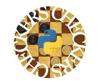

[](https://github.com/j-w-s/CSC-132-Final-Project/graphs/contributors?from=2021-04-07&to=2021-04-09&type=c)
[](https://www.python.org/)

<!-- CHECKERS EMBLEM AND DESCRIPTION OF PROJECT-->
<br />
<p align="center">
  <a href="https://github.com/j-w-s/CSC-132-Final-Project">
    
  </a>

  <h3 align="center">CHECKERS</h3>

  <p align="center">
    A project for CSC 132 completed by 3 students using Python
    <br />
    <a href="https://github.com/j-w-s/CSC-132-Final-Projecte"><strong>Project»</strong></a>
    <br />
  </p>
</p>

<!-- TABLE OF CONTENTS -->
<details open="open">
  <summary>Table of Contents</summary>
  <ol>
    <li>
      <a href="#about-the-project">About Project</a>
    </li>
    <li>
      <a href="#getting-started">Getting Started</a>
      <ul>
        <li><a href="#prerequisites">Prerequisites</a></li>
        <li><a href="#installation">Installation</a></li>
      </ul>
    </li>
    <li><a href="#usage">Usage</a></li>
    <li><a href="#features">Features</a></li>
    <li><a href="#contact">Contact</a></li>
  </ol>
</details>

<!-- ABOUT PROJECT -->
## About Project

We need to add more information about the project: descriptions of the project, screenshots, etc.

<!-- GETTING STARTED -->
## Getting Started

We need to add information about the project: how we built the enclosure, how we soldered the wires for the breadboard, etc.

### Prerequisites

We need to list the materials that we bought.

Download and install Python:
  ```sh
https://www.python.org/ftp/python/3.9.4/python-3.9.4-amd64.exe
  ```
### Installation

We need to discuss how we utilized the materials (soldering, laser cutting, and more), etc.
1. Install tkinter:
   ```sh
   py -m pip install tkinter
   ```
2. 
3. 

<!-- CONTRIBUTORS-->
## Contributors

[](https://github.com/j-w-s)
[](https://github.com/Kotablip)
[](https://github.com/Sherm1111)
