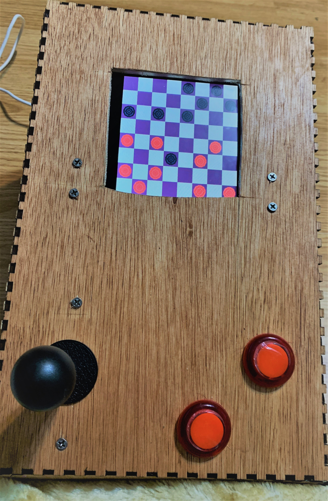
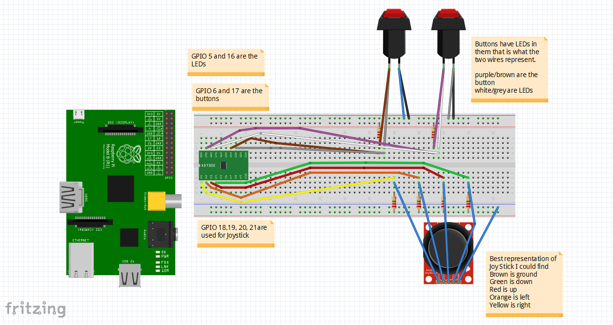
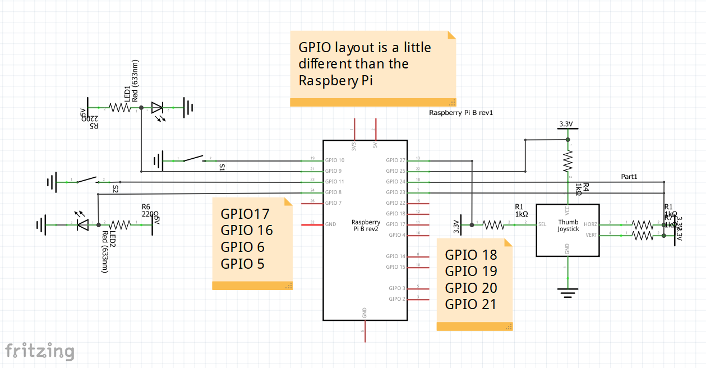

<!--
*** README created with help from: https://github.com/othneildrew/Best-README-Template#roadmap
*** I do NOT know HTML well enough to have done this without it!
-->


[](https://github.com/j-w-s/CSC-132-Final-Project/graphs/contributors?from=2021-04-07&to=2021-04-09&type=c)
[](https://www.python.org/)

<!-- CHECKERS EMBLEM AND DESCRIPTION OF PROJECT-->
<br />
<p align="center">
  <a href="https://github.com/j-w-s/CSC-132-Final-Project">
    
  </a>

  <h3 align="center">CHECKERS</h3>

  <p align="center">
    A project for CSC 132 completed by 3 students using Python
    <br />
    <a href="https://github.com/j-w-s/CSC-132-Final-Projecte"><strong>Project»</strong></a>
    <br />
  </p>
</p>

<!-- TABLE OF CONTENTS -->
<details open="open">
  <summary>Table of Contents</summary>
  <ol>
    <li>
      <a href="#about-project">About Project</a>
    </li>
    <li>
      <a href="#getting-started">Getting Started</a>
      <ul>
        <li><a href="#prerequisites">Prerequisites</a></li>
        <li><a href="#installation">Installation</a></li>
        <li><a href="#building">Building</a></li>
      </ul>
    </li>
    <li><a href="#features">Features</a></li>
    <li><a href="#contributors">Contributors</a></li>
  </ol>
</details>

<!-- ABOUT PROJECT -->
## About Project

This project ecnompasses 3 students' implementation of the game Checkers using the Python scripting language, the module tkinter, and GPIO input from a breadboard to the Raspberry Pi 3b.

<p align="center">
  <a href="https://github.com/j-w-s/CSC-132-Final-Project">
    
  </a>
  <br>


  <br/>

<!-- GETTING STARTED -->
## Getting Started

This section contains information regarding the creation and use of this project: how we built the enclosure, how we synthesized compatability with the breadboard, the total expenditure of monetary resources for the materials of the project, the installation of this software, and more.

### Prerequisites

<b> Hardware necessary for the project </b>
1. A square board with dimensions 0.20"x23.88"x23.88"
2. A Raspberry Pi 3b or other compatible device
3. A screen capable of displaying output from the Raspberry Pi 3b or other compatible device
5. A screwdriver kit
6. A utility knife
7. A drill
8. Wood Glue
9. Access to a laser cutter that can read and utilize .dfx files
10. Small latches with dimensions 1"x1"
11. Buttons and a joystick from Amazon or competing retailer

<b> Software necessary for the project </b>

1. The latest version of Python, which can be downloaded below:
  ```sh
  https://www.python.org/ftp/python/3.9.4/python-3.9.4-amd64.exe
  ```
2. The following .dfx file:
  ```sh
  https://github.com/j-w-s/Checkers/blob/main/Console.dxf
  ```
  
<b> Total cost for project </b>


### Installation

1. Run the previously downloaded executable file for Python 3.X and install Python
2. Load the command prompt and install tkinter via the following command:
   ```sh
   py -m pip install tkinter
   ```
3. From the github project, download the folder titled Checkers
4. Unzip the downloaded folder to a preferred location
5. Load IDLE and open the .py file with name "checkers.py" stored inside the folder saved at the preferred location mentioned in step 4
6. Select run

### Building

1. Load the .dfx file to a machine that can laser-cut the design for the enclosure of the Raspberry Pi 3b
2. Cut the wooden planks
3. Stain cut pieces and let dry
4. Assemble cut pieces for the enclosure
5. Drill holes for the buttons, joystick, and power cord
6. Use a utility knife to cut a hole in the top piece of the enclosure for the display of the Raspberry Pi 3b or competing device
7. Use screws to ground accessories to their designated locations on the enclosure
8. Use wood glue to seal pieces together

<!-- FEATURES -->
## Features

The main program included in this project implements the game Checkers.
Players of the game may utilize a single joystick and pair of buttons to move pieces around the board and approve or decline their movements.
This version of the game follows the standard rules of the game, such that:
1. Black moves first. Players then alternate moves. 
2. Moves are allowed only on the dark squares; pieces only move diagonally forward, toward the opponent. However, Kings can also move backwards.  
3. A piece may only move one square unless it is making a jump.
4. Etc.

Above information adapted from the below source, which contains all rules of the game:
   ```sh
   https://winning-moves.com/images/kingmerulesv2.pdf
   ```

<!-- CONTRIBUTORS-->
## Contributors

[](https://github.com/j-w-s)
[](https://github.com/Kotablip)
[](https://github.com/Sherm1111)
